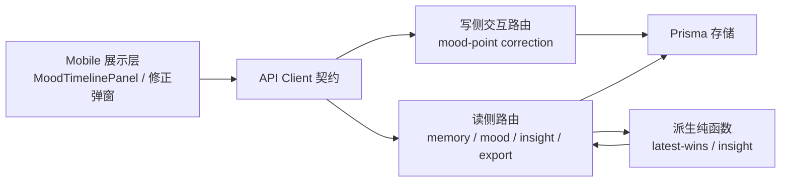

# 心伴 v0.5 架构视图与边界复核

## 1. 图谱注册

- 工具：`graphify 0.9.32`。
- 当前仓库：`/Users/leo/.myrd/workspaces/cms1g8itk000am9fyr4l0vp35/run-cmuvv1ya80154icry4hbxbhgj`。
- 增量前重建本仓图谱：`graphify extract . --code-only --no-cluster --out .`。
- 确定性聚类：`graphify cluster-only . --no-label --no-viz`。
- 全局注册：`graphify global add graphify-out/graph.json --as xinban-v05`。
- 证据：`docs/v0.5/evidence/graphify-register.log`；图谱产物：`graphify-out/graph.json`、`graphify-out/GRAPH_REPORT.md`。

## 2. 运行视图



- **核心交互层**：`routes/chat.ts` 负责鉴权、输入校验、目标归属检查和追加 `MoodCorrection`；不聚合洞察。
- **存储层**：`MoodSnapshot` 原始事实不变；`MoodCorrection` 只追加，不 UPDATE/DELETE 原始情绪点。
- **派生层**：`conversationInsights.ts` 先按 correction 序号做 latest-wins，再供 timeline、洞察和导出消费；派生层不直接访问 Prisma。
- **展示层**：列表项提供「修正」入口，保存成功后使用返回 point 局部更新；写失败回显原值和降级提示。

## 3. 单向边界复核

| 依赖方向 | 结论 | 证据 |
|---|---|---|
| 派生层 → 存储 | 不成立 | `moodInsight.ts` / `conversationInsights.ts` 不 import `db.ts`，由路由传入读契约 |
| 派生层 → 核心交互 | 不成立 | 派生函数只接收 memory/timeline 数据契约 |
| 核心交互 → 存储 | 成立 | 路由通过 `prisma` 读写；业务错误统一 `AppError` |
| 展示 → API → 核心交互 | 成立 | UI 只调用 `ApiClient`，不直接访问 Prisma |

图谱复核命令与拓扑锚点：

```bash
graphify god-nodes --top 10 --graph graphify-out/graph.json
grep -n "MoodCorrection" apps/server/prisma/schema.prisma
```

导入环仍为 `0`；v0.5 只在核心交互层新增写入口，未让派生层反向调用路由或 Prisma。

## 4. 架构决策

1. **追加修正而非覆盖**：保证 v0.2/v0.4 原始数据契约可回放；读侧解析最新 correction。
2. **加表不加外部迁移依赖**：SQLite 通过既有 `prisma db push` 做 additive schema evolution；不改旧表字段。
3. **降级留在交互层**：写失败由路由回传旧 point 和 `degraded=true`，派生层只处理合法数据。
4. **导出独立路由**：`routes/export.ts` 只做用户授权、查询和冻结 schema 序列化，不承载编辑逻辑。

## 5. ADR

### ADR-005 · 情绪修正采用追加记录 + 读侧 latest-wins

- **状态**：Accepted。
- **背景**：用户需要修正 AI 判读的情绪值并补充标签/原因，但基线要求旧数据可回放。
- **决策**：不改写 `MoodSnapshot`；每次保存新增 `MoodCorrection`，timeline / insight / export 读取最新 correction。
- **备选**：直接 UPDATE snapshot（实现最小但丢失审计事实）；前端覆盖（重启丢失且多端不一致）。
- **代价**：读侧多一次 correction 查询和内存合并；原型数据量限制 50 点，成本可接受。

### ADR-006 · 导出仅冻结 JSON v1

- **状态**：Accepted。
- **背景**：用户要求 JSON only，且空库不能伪装成 404/500。
- **决策**：单一 `GET /api/v1/export`，schemaVersion=1，授权后聚合当前用户 conversation/message/memory/emotion/mood/correction。
- **备选**：CSV（砍单顺序冻结排除）；流式导出（原型规模下增加复杂度）。
- **代价**：大库单响应内存随数据增长；生产化前应分页/流式，本轮不扩展。

### ADR-007 · 写失败返回旧值降级态

- **状态**：Accepted。
- **背景**：编辑不能因存储抖动变成 500，也不能让 UI 假装保存成功。
- **决策**：写 correction 异常时 HTTP 200 返回原 point + `persisted=false/degraded=true`，日志记录原因。
- **代价**：调用方必须检查 persisted/degraded；契约已在文档和 UI 纯函数锁死。

## 6. 非功能与失败模式

| 关注点 | 设计 | 验证 |
|---|---|---|
| 鉴权 | correction 三重归属校验；export 只按当前 user 查询 | route tests + smoke 26 |
| 幂等 | `clientMutationId` 用户内重放；跨目标 409 | route replay test |
| 可用性 | correction 写失败不影响旧 point；timeline 存储失败显式 degraded | write-failure + v0.3 persist |
| 可审计 | original value + correction id/timestamp 保留 | latest-wins/export jq |
| 隐私 | 不导出 DeviceSession/SmsCode/Order/支付凭据 | export route test grep |
| 性能边界 | 修正查询按 conversation + user 索引；导出原型全量，生产需分页 | schema index + ADR-006 |
