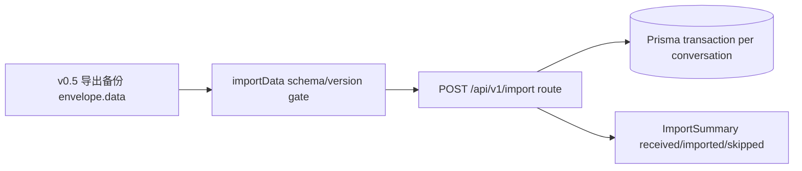

# 心伴 v0.6 架构增量

## 边界

- `lib/importData.ts`：只做冻结 schema、版本、批次内唯一 ID 与内部引用校验；不触库。
- `routes/import.ts`：鉴权、全局 conversation/character 引用预检、记录级 skip、按 conversation 事务写库。
- `routes/export.ts`：继续复用 v0.5 序列化，不感知导入。
- Mobile 本轮零 UI 增量；写侧闭环先交付 API 契约。

## 写入规则

- schema 或版本非法：在任何写库前抛 422，整批零写入。
- conversation 已存在：仅该记录 skip，其他 conversation 继续导入。
- 引用的 characterId 不存在：仅该 conversation skip。
- 每个 conversation 的 messages、memories、emotion、moodSnapshots、corrections 在一个事务内恢复。

## 数据映射

| JSON | SQLite |
|---|---|
| `metadata` / `payload` | `JSON.stringify` |
| `keywords` / `tags` | comma join |
| ISO 时间 | `new Date(...)` |
| conversation/message/memory/mood/correction id | 保留，作为幂等锚点 |

